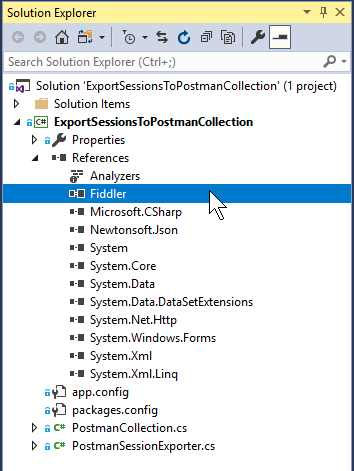
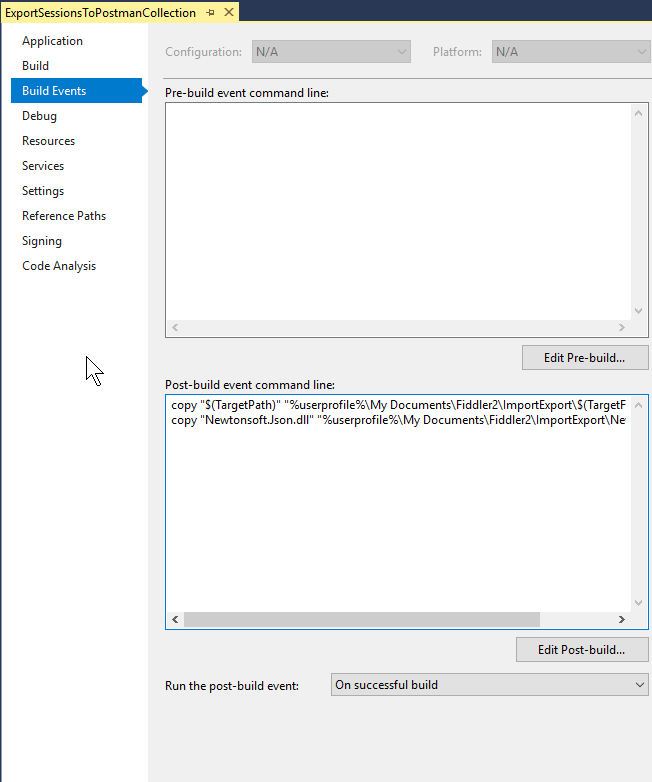
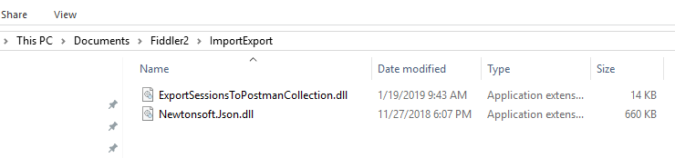
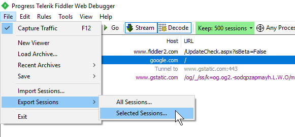
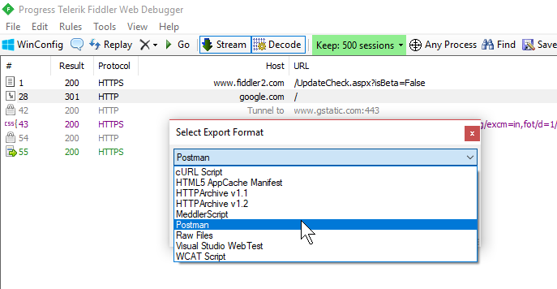
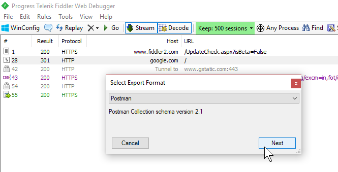

# FiddlerExportToPostman

This is a Fiddler extension for exporting sessions into a format that can be imported by Postman.

It exports the sessions as Postman collection JSON version 2.1.

I tested this against Fiddler v5.0.20182.28034 for .NET 4.6.1.

## Building This Project

Fiddler.exe is a direct reference in ExportSessionsToPostmanCollection.csproj. 

In order to build this
project you must change it to the correct installation location for wherever Fiddler is installed
on your system. This is `..\..\..\Users\bdrupieski\AppData\Local\Programs\Fiddler\Fiddler.exe`
for me but might be `C:\Program Files (x86)\Fiddler2\Fiddler.exe` for you if you're using a
different version. You can fix this by right-clicking "References" in the Solution Explorer, clicking
"Add Reference...", and choose "Browse..." to find Fiddler.exe on your machine.

There are two post-build events to copy files to where Fiddler can see them and load them as extensions.

You'll have to change these paths to match your system too, if they're different. The "ImportExport" 
folder under "%userprofile%\My Documents\Fiddler2\" does not seem to be created by default. If you don't
see it, create it. This is where the extension .dll will be copied to and where Fiddler will look for it
when it starts.

If it works, you should see two .dll files copied to your Fiddler ImportExport folder:

## Using this Extension

Fiddler will automatically detect the presence of the extension when it starts up. If there's a
problem you should see something in the Log tab.

Select sessions to export:

Postman should be an option in the dropdown:

